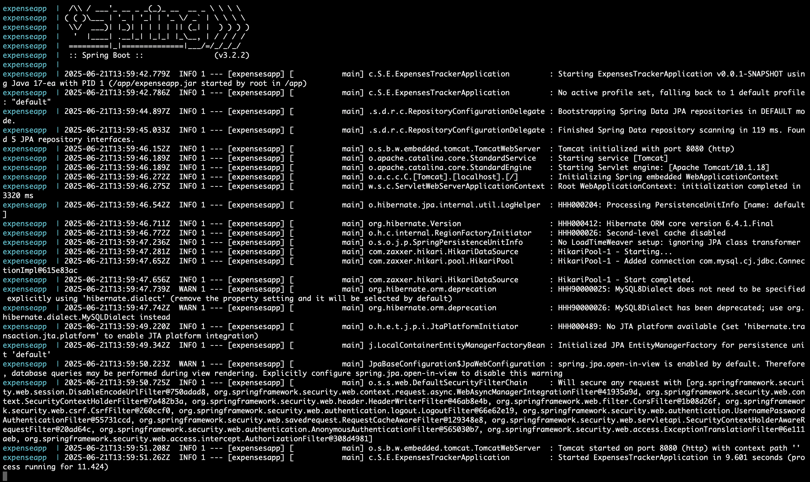

# Dockerized Spring Boot Expenses Tracker – DevOps Deployment Project
## Overview
This repository showcases the Dockerization and deployment of a Spring Boot-based Expenses Tracker Web Application, originally developed by another author. The core application handles expense tracking, user authentication, and financial data filtering.

As a DevOps Engineer, I containerized the entire stack using Docker, orchestrated services with Docker Compose, and deployed the application on an AWS EC2 instance. This project highlights my experience in containerization, cloud deployment, and environment setup for Java Spring Boot apps.

## My Responsibilities
- Wrote the Dockerfile to containerize the Spring Boot application
- Created a docker-compose.yml file to manage both Spring Boot and MySQL containers
- Configured environment variables, volumes, ports, and MySQL integration
- Provisioned and configured an AWS EC2 instance (Ubuntu)
- Installed and configured Docker & Docker Compose on the cloud VM
- Deployed the containers, verified the application runs end-to-end in the browser
- Ensured app persistence, startup health, and basic security best practices

## Technologies Used
- Java
- Spring boot
- Spring MVC
- Spring Security
- Spring Data (JPA)
- MySQL
- Thymeleaf
- Bootstrap
- Docker
- Docker Compose
- Amazon EC2 (Ubuntu)

## Features
- **User Authentication and Authorization:** Securely sign up, sign in, and access the app with built-in authentication and authorization.
- **CRUD Operations:** Perform essential financial tracking actions such as adding, reading, updating, and deleting expenses.
- **Filtering:** Utilize the filtering feature to efficiently sort and view expenses based on various criteria.

## Getting Started
1. **Clone the Repository:**
`git clone https://github.com/your-username/dockerized-expenses-tracker.git`

2. **Configure Database:**
Set up MySQL database and update the application.properties file with your database configuration.

3. **Run with Docker Compose:**
   `docker compose up -d --build`.

4. **Visit the localhost or AWS EC2 ip address:**
`http://localhost:8080 or http://aws-ec2-ip-address:8080`.

## ScreenShots
  
  
  
  
  
  
  
  

## Original App Features (by Developer)
Though I did not develop the application logic, the following features are included as part of the original codebase:
- **Authentication & Authorization** -> Secure login and registration via Spring Security
- **Expense Management ** -> Add, update, delete, and filter expenses
- **Filtering** -> View expenses based on category, date, etc.

## Contributions
Contributions are welcome! If you find a bug or have suggestions for improvement, feel free to open an issue or create a pull request.

## Credits
Original Code Author: `https://github.com/mohamed0sawy/Expenses-Tracker-WebApp`
DevOps, Dockerization, and Deployment: `https://github.com/abhijha16`

## License
This project is licensed under the MIT License.
